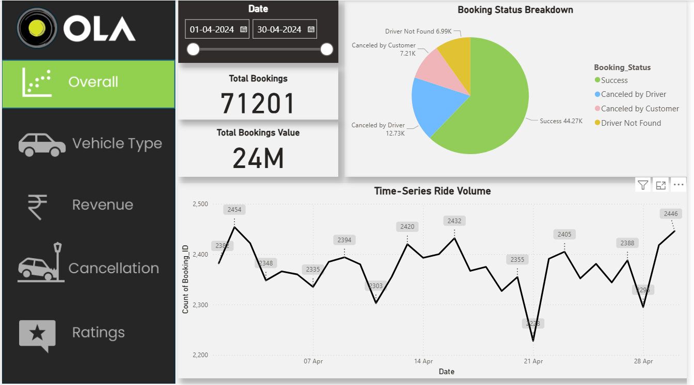

# 🚘Ola Bookings Analysis

## 📌 Project Overview
This project analyzes ola booking data to uncover trends, patterns, and KPIs using **Excel**, **SQL**, and **Power BI**.  
The dataset contains over **70,000 ride booking records**, including booking details, cancellation information, and customer ratings.

The goal of this project is to:
- Identify booking patterns and ride trends
- Track vehicle type performance
- Measure revenue 
- Understand cancellation rate
- Identify Customer & Driver Ratings

---

## 📊 Key Features
- **Excel** – Initial data cleaning, preprocessing, and structuring
- **SQL** – Querying and aggregating data to extract booking trends and KPIs
- **Power BI Dashboard** – Multi-page interactive dashboard with:
  - Overall Bookings
  - Vehicle Type Analysis
  - Revenue Insights
  - Cancellations Overview
  - Ratings Distribution

---

## ⚙️ Tools & Technologies
- **Microsoft Excel** – Data cleaning and preparation
- **SQL** – Data querying and aggregation
- **Power BI** – Data visualization and dashboard creation

---

## 📂 Project Structure

```plaintext
Ola-Bookings-Analysis/
│
├── Dataset/                # Ola bookings dataset
├── Images/                 # Dashboard screenshots
├── PowerBI Dashboard/      # Power BI .pbix file
├── SQL Queries/            # SQL scripts for analysis
└── README.md               # Project documentation
```
---
## 📷 Dashboard Preview



---
## 📈 Insights Derived
- Total Successful Bookings and Value
- Total Booking value and Average distance travelled per vehicle type
- Revenue distribution across different payment methods
- Rides cancellation breakdown
- Customer and Drivers ratings

